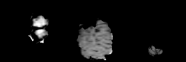

# Brain Tumor Segmentation

This project demonstrates brain tumor segmentation through visualizations.

<table>
  <tr>
    <th>Label Visualization</th>
    <th>Prediction Visualization</th>
    <th>Overlay Visualization</th>
  </tr>
  <tr>
    <td>
      
    </td>
    <td>
      
    </td>
    <td>
      
    </td>
  </tr>
</table>

### Reference
For more details, visit the [GitHub Repository](https://github.com/faizan1234567/Brain-Tumors-Segmentation).
